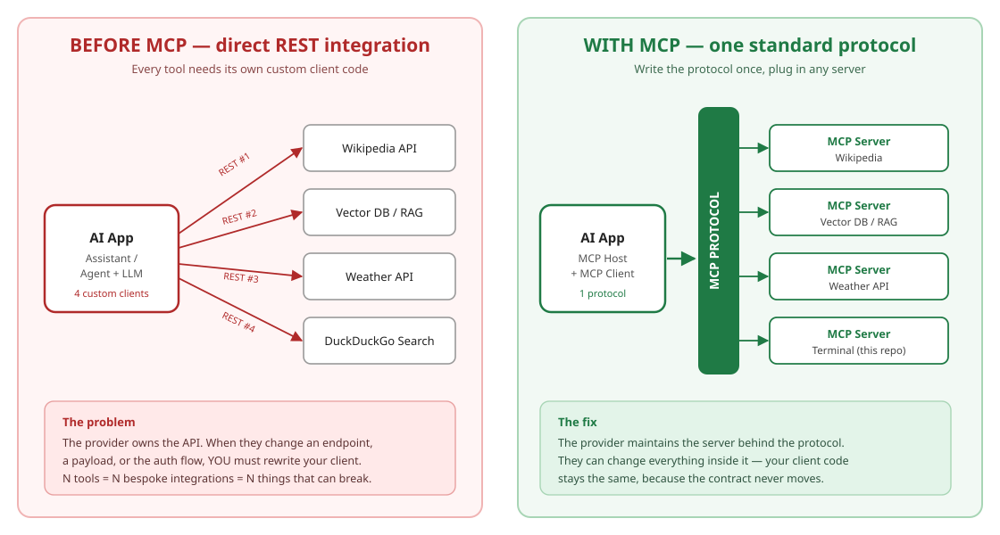
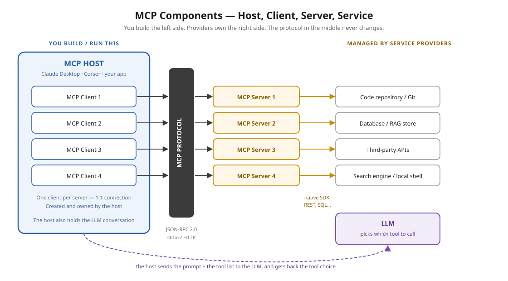
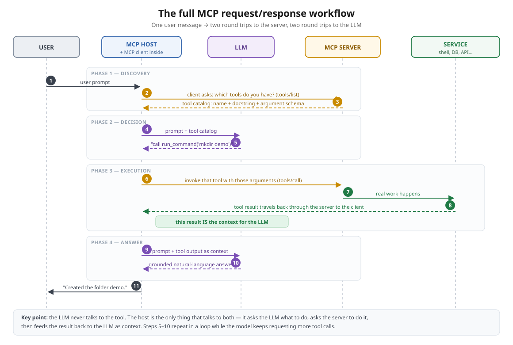
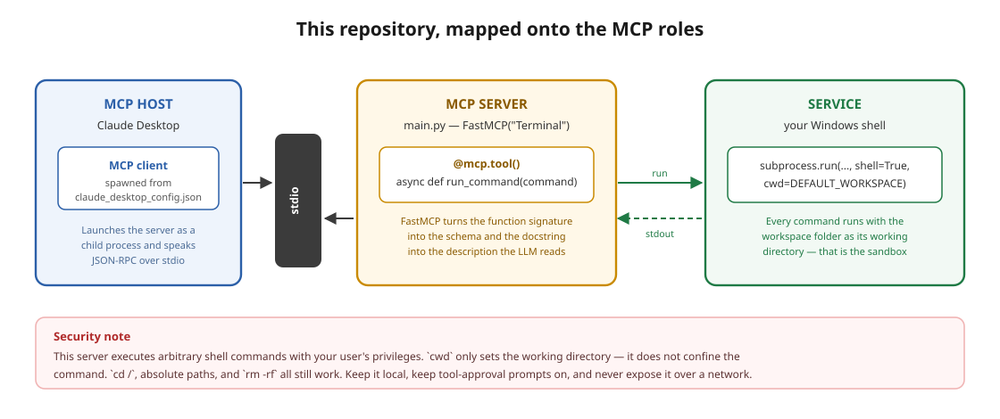
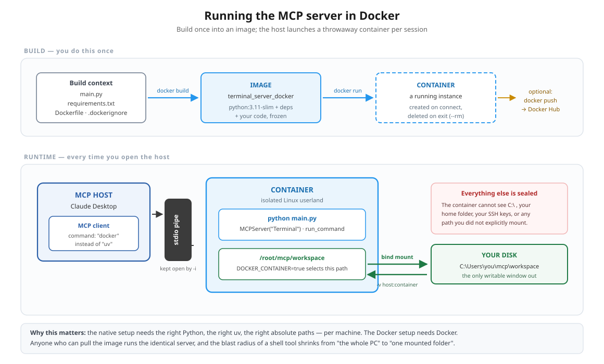

# Terminal MCP Server

A small, complete **Model Context Protocol (MCP)** server written with **FastMCP** and managed with **uv**. It gives an AI host — Claude Desktop, Cursor, or your own app — the ability to run shell commands inside a sandboxed workspace folder on your machine.

The code is ~30 lines. The rest of this README explains the protocol it implements, because that is the part worth learning.

---

## Table of contents

- [The 60-second version](#the-60-second-version)
- [What problem does MCP solve?](#what-problem-does-mcp-solve)
- [The components: host, client, server, service](#the-components-host-client-server-service)
- [The full workflow, step by step](#the-full-workflow-step-by-step)
- [FastMCP](#fastmcp)
- [uv](#uv)
- [This project](#this-project)
- [Setup](#setup)
- [Connecting to Claude Desktop](#connecting-to-claude-desktop)
- [Trying it out](#trying-it-out)
- [Code walkthrough](#code-walkthrough)
- **Docker**
  - [Why containerise an MCP server?](#why-containerise-an-mcp-server)
  - [Installing Docker](#installing-docker)
  - [The Docker files in this repo](#the-docker-files-in-this-repo)
  - [Building the image](#building-the-image)
  - [Connecting the container to Claude Desktop](#connecting-the-container-to-claude-desktop)
  - [Every flag in the docker run command](#every-flag-in-the-docker-run-command)
  - [Testing the containerised server](#testing-the-containerised-server)
  - [Sharing the image](#sharing-the-image)
  - [Docker housekeeping](#docker-housekeeping)
- [Troubleshooting](#troubleshooting)
- [Security](#security)

---

## The 60-second version

> **MCP** is an open protocol from Anthropic that standardises how an application gives an LLM access to tools and data. Think of it as **USB-C for AI applications**: one connector shape, and any compliant peripheral works.
>
> - **MCP host** — the app the user is in (Claude Desktop, Cursor, your agent). It holds the LLM conversation.
> - **MCP client** — the connector living *inside* the host. One client per server, 1:1.
> - **MCP server** — a process that exposes tools/resources over the protocol. **This repository is one.**
> - **Service** — the actual thing behind the server: a shell, a database, an API.
>
> A user message triggers **two round trips to the server** (first "what tools do you have?", then "run this one") and **two round trips to the LLM** (first "which tool?", then "here's the result, answer the user").
>
> The payoff: the service provider maintains everything behind the protocol. They can rewrite their internals freely and **your client code never changes**, because the contract sits at the protocol, not at their API.

---

## What problem does MCP solve?

### Life before MCP

Before MCP, connecting an AI app to an external tool meant writing a REST client — a `GET`/`POST` against some HTTP endpoint, parse the JSON, map it into your tool-calling layer. The same pattern you'd use in any web app, and the same pattern LangChain/LangGraph tool integrations were built on.

That works. It just doesn't scale across vendors:

- Every tool is a **separate bespoke integration**. Ten tools, ten clients to write and maintain.
- The **provider owns the API**, and you own the client. When they rename a field, version an endpoint, or change auth, **your code breaks and you fix it**.
- Nothing is reusable. Your Wikipedia integration teaches you nothing about integrating a vector DB.

Multiply that across an agentic app where a dozen graph nodes each call out to external services, and integration maintenance quietly becomes the bulk of the work.

### Life with MCP

MCP inserts a **standard protocol layer** between the AI app and the tools. Instead of your app speaking four different REST dialects, it speaks MCP — and each provider ships a server that also speaks MCP.



The critical shift is **who maintains what**:

| | Before MCP | With MCP |
|---|---|---|
| Integration code | One custom client **per tool**, written by you | One protocol implementation, reused for every server |
| Who absorbs breaking changes | **You** | **The provider**, behind their server |
| Tool discovery | Hardcoded — you read docs and write schemas by hand | Runtime — the client asks the server what it offers |
| Adding a tool | Write and test a new client | Add a config entry |
| Transport | HTTP request/response | JSON-RPC 2.0 over stdio or HTTP |
| Direction of calls | Client → server only | Bidirectional — servers can also ask the client for things |

### The USB-C analogy, precisely

A laptop has one USB-C port. Keyboard vendors, mouse vendors and charger vendors each build to the USB-C spec. When a vendor redesigns their mouse internals, your laptop needs no change — both sides agreed on the connector, not on the internals.

MCP is that connector for AI apps. Your host implements the protocol once; every compliant server plugs in.

### Is MCP a replacement for REST?

No — and this trips people up. MCP servers very often call REST APIs *internally*. MCP standardises the **AI-app-to-tool** edge; REST still lives behind it. The difference is that the REST client now lives in the provider's server, maintained by them, instead of in your codebase, maintained by you.

---

## The components: host, client, server, service



### MCP Host

The application the user actually interacts with, and the only component that talks to *both* the LLM and the servers.

Examples: **Claude Desktop**, **Cursor**, VS Code extensions, or any app you write. Its responsibilities:

- own the conversation and the LLM calls
- read config to know which servers exist, and launch them
- create one MCP client per server
- assemble the tool catalog from all connected servers and pass it to the model
- enforce permission (the "allow this tool?" prompt you see in Claude Desktop)

### MCP Client

The connector object that lives inside the host. **One client per server — a strict 1:1 relationship.** Four servers configured means the host creates four clients.

The client handles the protocol handshake, `tools/list` and `tools/call` requests, and keeps the session alive. You rarely write one by hand; the host does it for you. It is the *only* thing that speaks to a server.

### MCP Server

A program that exposes capabilities over MCP. Three kinds of capability:

| Capability | What it is | Controlled by |
|---|---|---|
| **Tools** | Functions the model can invoke to *do* something | the model |
| **Resources** | Read-only data the host can load as context (files, records) | the host/app |
| **Prompts** | Reusable prompt templates the user can select | the user |

This repo exposes exactly one **tool**, `run_command`. Servers can run locally as a child process (talking over **stdio**, what we use here) or remotely over HTTP.

### Service

The real system the server fronts: a shell, Postgres, the GitHub API, a vector store. The server is a thin adapter; the service does the work.

**This is the layer the provider owns.** All the churn happens here, and none of it reaches you.

---

## The full workflow, step by step

Here is what actually happens when you type *"create a folder called demo"* into a host with this server connected.



**Phase 1 — Discovery**

1. The user sends a prompt to the host.
2. The host's MCP client asks each connected server: *what tools do you have?* (`tools/list`)
3. Each server replies with its catalog: tool **name**, **description** (from the docstring) and **argument schema** (from the type hints).

**Phase 2 — Decision**

4. The host sends the LLM the user's prompt **plus** the tool catalog.
5. The LLM replies with a decision — not with an answer: *call `run_command` with `command="mkdir demo"`.* The model chooses; it does not execute.

**Phase 3 — Execution**

6. The host's client sends the actual invocation to the server (`tools/call`). This is where the host asks the user for permission, if configured.
7. The server runs the real work against the service — here, `subprocess.run` in your shell.
8. The result travels back: service → server → client → host. **This result is the context.** Everything so far exists to produce this string.

**Phase 4 — Answer**

9. The host sends the LLM the conversation **plus** the tool output as context.
10. The LLM, now grounded in a real result rather than guessing, writes the answer.
11. The host shows it to the user.

### Three things worth internalising

- **The LLM never touches the tool.** It only ever emits a *request* to call one. The host executes it. That separation is what makes permission prompts, logging and sandboxing possible.
- **The loop repeats.** If the model wants another tool call after seeing a result, steps 5–10 run again. Multi-step tasks are just this loop iterating.
- **Discovery is at runtime.** The host doesn't know your tools until it asks. That's why you can add a tool to a server, restart the host, and the model immediately knows about it — no host code changed.

---

## FastMCP

Implementing MCP from scratch means writing a JSON-RPC message loop, the initialize handshake, protocol version negotiation, tool registry, content-type handling and error envelopes. That is a lot of boilerplate for what is conceptually "expose this function."

**FastMCP** (bundled in the `mcp` Python package) handles all of it. It's the high-level, Pythonic API — in most cases **decorating a function is all you need**:

```python
from mcp.server.mcpserver.server import MCPServer as FastMCP

mcp = FastMCP("Terminal")        # name the host will display

@mcp.tool()                      # register the function as an MCP tool
async def run_command(command: str) -> str:
    """Run a terminal command inside the workspace directory."""
    ...

if __name__ == "__main__":
    mcp.run(transport="stdio")   # start serving
```

### How your function becomes a tool definition

`@mcp.tool()` introspects the function and derives the exact JSON the LLM will see:

| Source in your code | Becomes | Why it matters |
|---|---|---|
| Function name `run_command` | tool `name` | how the model refers to it |
| **Docstring** | tool `description` | **how the model decides whether to use it** |
| Type hints `command: str` | `inputSchema` | how the model formats arguments |
| Return value | tool result content | the context fed back to the model |

### Write the docstring like a prompt, because it is one

The docstring is not a comment for humans — it is shipped to the LLM verbatim during discovery, and it is the *only* thing the model has to go on when deciding whether this tool fits the request. A vague docstring means the tool is silently never chosen.

Say what it does, when to use it, what each argument is, and what comes back:

```python
"""
Run a terminal command inside the workspace directory.
If terminal command can accomplish the task,
tell the user you'll use the tool to accomplish it,
eventhough you cannot directly do it

Args:
    command: The shell command to run.

Returns:
    The command output or error message
"""
```

That middle sentence is deliberate steering: without it, a model will often reply *"I can't run commands on your computer"* instead of reaching for the tool it was just handed.

### `async`

Tool functions are declared `async`. FastMCP serves requests on an event loop, so an async signature lets a tool await I/O without blocking the whole server. Note that `subprocess.run` in this file is *synchronous* and will block the loop for the duration of the command — fine for a single-user local server, worth revisiting if you ever run long commands concurrently.

---

## uv

**uv** is an extremely fast Python package and project manager, written in Rust. It replaces `pip` + `venv` + `pyproject` tooling with one binary, and it's the standard way to run MCP servers because the host needs a single deterministic command to launch your script.

Install on Windows (PowerShell):

```bash
powershell -ExecutionPolicy ByPass -c "irm https://astral.sh/uv/install.ps1 | iex"
```

On macOS / Linux:

```bash
curl -LsSf https://astral.sh/uv/install.sh | sh
```

It lands in `C:\Users\<you>\.local\bin\uv.exe` on Windows — **note that path, the host config needs it.**

Commands used in this project:

| Command | What it does |
|---|---|
| `uv --version` | verify the install |
| `uv init` | scaffold a project (`pyproject.toml`, `main.py`, `.python-version`) |
| `uv venv` | create a virtual environment in `.venv` |
| `uv add "mcp[cli]"` | add a dependency and update `pyproject.toml` + `uv.lock` |
| `uv run main.py` | run inside the project env, syncing deps first |
| `uv run mcp install main.py` | register this server into Claude Desktop's config |

`uv.lock` pins exact resolved versions so the environment is reproducible. Commit it.

---

## This project



```
Terminal_MCP_Server/
├── main.py           # the MCP server — MCPServer instance + one tool
├── pyproject.toml    # project metadata and dependencies (uv)
├── uv.lock           # pinned dependency versions (uv)
├── requirements.txt  # dependencies for the Docker image (pip)
├── Dockerfile        # recipe for the container image
├── .dockerignore     # what to keep out of the build context
├── .python-version   # Python version pin for uv
├── docs/             # the diagrams in this README
└── temp/             # the sandboxed workspace when running natively
```

| MCP role | Filled by |
|---|---|
| Host | Claude Desktop |
| Client | created by Claude Desktop from `claude_desktop_config.json` |
| Server | `main.py` — `MCPServer("Terminal")` |
| Tool | `run_command(command: str) -> str` |
| Service | a shell — your Windows shell natively, the container's Linux shell in Docker |
| Transport | stdio (server runs as a child process of the host) |

There are **two ways to run this server**, and the rest of the README covers both:

| | Native (`uv`) | Docker |
|---|---|---|
| Host launches | `uv.exe run … main.py` | `docker run … terminal_server_docker` |
| Shell the tool drives | your Windows shell | the container's Linux shell |
| Workspace | `temp/` in this repo | a folder you bind-mount |
| Needs on a fresh machine | matching Python + uv + correct paths | Docker only |
| Reach of a bad command | your whole user account | the container + mounted folder |

---

## Setup

From scratch:

```bash
mkdir -p Terminal_MCP_Server
```

```bash
cd Terminal_MCP_Server
```

```bash
uv init
```

```bash
uv venv
```

Activate it — PowerShell:

```bash
.venv\Scripts\Activate.ps1
```

Add the dependency (`[cli]` pulls in the `mcp` command-line tool used for install/dev):

```bash
uv add "mcp[cli]"
```

Run the server to confirm it starts:

```bash
uv run main.py
```

It will sit there with no output. That is correct — it's waiting for a host to speak JSON-RPC on stdin. `Ctrl+C` to stop.

To poke at it interactively before wiring up a host, use the MCP Inspector:

```bash
uv run mcp dev main.py
```

---

## Connecting to Claude Desktop

### Option A — automatic

```bash
uv run mcp install main.py
```

This locates `claude_desktop_config.json` and writes the server entry for you.

> **If it fails with "failed to update Claude config":** the config file is probably completely empty. Open it and put a single `{}` in it, save, and re-run. The installer needs valid JSON to merge into.

Open the config from Claude Desktop: **File → Settings → Developer → Edit Config**.

### Option B — manual

Edit `claude_desktop_config.json` yourself:

- **Windows:** `%APPDATA%\Claude\claude_desktop_config.json`
- **macOS:** `~/Library/Application Support/Claude/claude_desktop_config.json`

```json
{
  "mcpServers": {
    "Terminal": {
      "command": "C:\\Users\\<you>\\.local\\bin\\uv.exe",
      "args": [
        "run",
        "--with",
        "mcp[cli]",
        "mcp",
        "run",
        "D:\\Project\\MCP\\Terminal_MCP_Server\\main.py"
      ]
    }
  }
}
```

Two Windows-specific things that cause most failures:

1. **Use the absolute path to `uv.exe`.** The host does not inherit your shell's `PATH`. If the auto-installer wrote an Anaconda `uv` path and that isn't the uv you actually use, replace it with `C:\Users\<you>\.local\bin\uv.exe`.
2. **Escape backslashes** — `\\` in JSON, everywhere.

### Restart Claude Desktop properly

Closing the window is not enough; it keeps running in the tray. Quit it fully — Task Manager if needed — then reopen.

Verify: the tools icon in the chat box should list **Terminal**, and **Settings → Developer → Terminal** should show status *running*.

---

## Trying it out

Ask in plain language — you never name the tool:

> Can you create a directory called `claude_output` and make a file inside called `terminal_test.txt`?

Claude will announce it's using the terminal tool, prompt you to allow it the first time, and the folder will appear under `temp/`.

Then:

> Add the text "I have successfully made my first MCP server 🎉" to that file, then open it in VS Code.

**Contrast with no server connected:** ask the same thing and Claude will hand you back the string `mkdir claude_output` as text. It knows the command; it has no way to run it. The tool is the difference between describing an action and taking one.

---

## Code walkthrough

`main.py`, in order:

```python
from mcp.server.mcpserver.server import MCPServer as FastMCP
mcp = FastMCP("Terminal")
```

Creates the server. `"Terminal"` is the display name in the host UI and the key `mcp install` writes into the config. On `mcp>=2.0.0` the class is `MCPServer`; we alias it to `FastMCP` so the familiar name reads through the rest of the file.

```python
if os.environ.get("DOCKER_CONTAINER") == "true":
    DEFAULT_WORKSPACE = "/root/mcp/workspace"
else:
    DEFAULT_WORKSPACE = os.path.expanduser("d:/Project/MCP/Terminal_MCP_Server/temp")
os.makedirs(DEFAULT_WORKSPACE, exist_ok=True)
```

The workspace. Every command runs with this as its working directory, so `mkdir demo` lands here rather than wherever the host was launched from. `expanduser` is what makes a leading `~` work; absolute paths pass through unchanged. `exist_ok=True` makes startup idempotent.

The branch exists because the correct path **depends on where the server is running**. Natively it's a Windows path on your disk; inside the container it must be the Linux path the host folder is bind-mounted onto. The container announces itself via `-e DOCKER_CONTAINER=true` in the Docker config entry — see [Every flag in the docker run command](#every-flag-in-the-docker-run-command).

```python
@mcp.tool()
async def run_command(command: str) -> str:
```

Registration. Name, description and schema are all derived from this signature and its docstring — see [FastMCP](#fastmcp).

```python
result = subprocess.run(command, shell=True, capture_output=True,
                        cwd=DEFAULT_WORKSPACE, text=True)
```

| Argument | Why |
|---|---|
| `shell=True` | hand the string to the system shell so pipes, `&&` and globbing work as typed |
| `capture_output=True` | collect stdout/stderr instead of letting them leak into the stdio channel — **printing to stdout would corrupt the JSON-RPC stream and kill the connection** |
| `cwd=DEFAULT_WORKSPACE` | run inside the workspace |
| `text=True` | decode bytes to `str` so the result can be returned directly |

```python
return result.stdout or result.stderr
```

Prefer stdout, fall back to stderr when the command wrote nothing to stdout (usually because it failed). This return value **is** the context handed back to the LLM at step 9.

```python
except Exception as e:
    return str(e)
```

Errors come back as a normal string rather than raising, so the model can read the failure, explain it, and retry with a corrected command.

```python
if __name__ == "__main__":
    mcp.run(transport="stdio")
```

Starts the event loop and blocks, serving MCP over stdin/stdout until the host disconnects. Guarded so importing the module doesn't start a server.

---

# Docker

Everything above runs the server **natively**: the host launches `uv`, which launches Python, which touches your real filesystem. That works on your machine. Getting it working on someone else's is a different story — and that is what containerising solves.

## Why containerise an MCP server?

### What Docker is, briefly

Docker is an open-source platform for building, shipping and running applications in **containers**. A container packages your code *together with* its dependencies and runtime, so it behaves identically wherever it runs. Unlike a virtual machine, containers share the host OS kernel, which makes them far lighter — they start in milliseconds and cost megabytes, not gigabytes.

Two terms to keep straight:

- **Image** — the frozen, immutable build artifact. Built once with `docker build`. Think "class".
- **Container** — a running instance of an image. Created with `docker run`, disposable. Think "object".

### The four problems MCP servers hit without it

Docker's own writeup on MCP names these directly, and anyone who has shared a server has met all four:

| Problem | What it looks like |
|---|---|
| **Environment conflicts** | The server needs Python 3.11 or a specific Node version, and the user's machine has something else. Global installs collide with whatever else they've got. |
| **No host isolation** | The server runs as your user, with access to every file and resource you have. A shell tool like this one has your entire account's reach. |
| **Complex setup** | Clone the repo, install the right Python, install uv, create a venv, install deps, find the absolute path to the uv binary, hand-edit JSON. Every step is a place to fail. |
| **Cross-platform drift** | x86 vs ARM, Windows vs macOS vs Linux. Path separators, shell differences, native wheels that don't build. |

A container collapses all four into one prerequisite: **have Docker.** The user runs a container instead of reproducing your environment.



### What actually changes

Nothing about the protocol. The host still speaks JSON-RPC over stdio, the discovery/decision/execution/answer loop is identical, the tool definition is unchanged. The *only* difference is what the host executes to start the server:

```
Native:   uv.exe run --with mcp[cli] mcp run D:\...\main.py
Docker:   docker run -i --rm --init -v ... terminal_server_docker
```

Both spawn a child process and pipe stdio to it. The MCP layer neither knows nor cares which.

---

## Installing Docker

### Windows

1. **Download Docker Desktop** from [docker.com](https://www.docker.com/products/docker-desktop/) — but install the prerequisites first.

2. **Enable the Windows features.** Search "Turn Windows features on or off" and tick both:
   - **Virtual Machine Platform**
   - **Windows Subsystem for Linux**

   Click OK and reboot.

3. **Install a Linux distro.** Docker runs on the Linux kernel, which Windows doesn't have — WSL2 supplies one. Install Ubuntu from the Microsoft Store, launch it once, and set a username and password when prompted.

4. **Update the WSL2 kernel** to 1.3.0 or later if Docker Desktop complains. Either run:

   ```bash
   wsl --update
   ```

   or install the standalone kernel update package Docker links to in the error.

5. **Run the Docker Desktop installer**, accept the defaults, and reboot if asked.

6. **Launch Docker Desktop** and wait for the status indicator in the bottom-left to turn **green**. Until it's green, no `docker` command will work.

### macOS / Linux

Docker Desktop has native installers for both; Linux users can also install Docker Engine directly from their package manager. No WSL step — the kernel is already there.

### Verify

```bash
docker --version
```

```bash
docker ps
```

`docker ps` listing zero running containers (just the header row) is a **success** — it means the CLI reached the daemon.

---

## The Docker files in this repo

### `Dockerfile`

The build recipe. Each instruction adds a layer to the image:

```dockerfile
FROM python:3.11-slim
WORKDIR /app
COPY . /app
RUN pip install --no-cache-dir -r requirements.txt
EXPOSE 5000
CMD ["python", "main.py"]
```

| Instruction | What it does |
|---|---|
| `FROM python:3.11-slim` | Base image. `-slim` drops build tools and docs — a fraction of the full image's size, plenty for pure-Python deps. |
| `WORKDIR /app` | Sets the working directory for every later instruction, and the default cwd of the container. |
| `COPY . /app` | Copies the build context (this folder, minus `.dockerignore` entries) into the image. |
| `RUN pip install --no-cache-dir -r requirements.txt` | Installs deps. `--no-cache-dir` skips pip's download cache, which would otherwise be baked into the layer as dead weight. |
| `EXPOSE 5000` | Documents a listening port. **Vestigial here** — this server talks over stdio and listens on nothing. Harmless, but it declares a port that is never used. |
| `CMD ["python", "main.py"]` | The process the container runs. This is our MCP server, speaking JSON-RPC on stdin/stdout. |

### `requirements.txt`

```
mcp[cli]>=2.0.0
```

The image installs with **pip**, not uv, so dependencies are declared here as well as in `pyproject.toml`. Keep the two in sync — if you `uv add` something, add it here too, or the container will fail at import time while the native run keeps working.

### `.dockerignore`

```
.venv

/temp
```

Excludes paths from the build context. Keeping `.venv` out matters: it contains Windows-built binaries that are useless (and potentially conflicting) inside a Linux image, and it's the single biggest thing in the folder.

---

## Building the image

From the project folder:

```bash
docker build -t terminal_server_docker .
```

- `-t terminal_server_docker` — **tags** the image with a name. This is what you reference in the Claude config.
- `.` — the **build context**: the folder Docker sends to the daemon and that `COPY` reads from. The trailing dot is easy to miss and required.

The first build downloads the Python base image and takes a minute or two. Later builds reuse cached layers and are much faster — which is why `COPY . /app` sitting *before* `pip install` is slightly wasteful: any code edit invalidates the cache and forces a reinstall of dependencies. Copying `requirements.txt` first, installing, then copying the code avoids that.

Confirm it exists:

```bash
docker images
```

You should see `terminal_server_docker` listed. It'll also appear in Docker Desktop under **Images**.

---

## Connecting the container to Claude Desktop

Same config file as before — `%APPDATA%\Claude\claude_desktop_config.json` — but the command is now `docker`:

```json
{
  "mcpServers": {
    "terminal_server": {
      "command": "docker",
      "args": [
        "run",
        "-i",
        "--rm",
        "--init",
        "-e", "DOCKER_CONTAINER=true",
        "-v", "C:/Users/<you>/mcp/workspace:/root/mcp/workspace",
        "terminal_server_docker"
      ]
    }
  }
}
```

Three things to change for your machine:

1. **The host side of the `-v` mount** — `C:/Users/<you>/mcp/workspace` must be a real folder you own. Create it first; Docker will otherwise create it as root-owned or fail. Forward slashes work fine here.
2. **The image name** must match your `-t` tag exactly.
3. **The server key** (`terminal_server`) is just the display name in Claude's UI.

Leave the container side of the mount (`/root/mcp/workspace`) alone unless you also change `DEFAULT_WORKSPACE` in `main.py` — they have to agree.

Then **quit Claude Desktop completely** (tray icon → Quit, or Task Manager) and reopen. Closing the window is not enough.

---

## Every flag in the docker run command

These are not decorative — each one is load-bearing for a stdio MCP server:

| Flag | Why it's there |
|---|---|
| `run` | Create and start a container from the image. |
| `-i` | **Interactive — keeps stdin open.** This is the single most important flag. MCP over stdio *is* the container's stdin/stdout. Without `-i`, stdin closes immediately and the server dies before the handshake completes. |
| `--rm` | **Delete the container when it exits.** Without it you accumulate a dead container every time Claude Desktop restarts. Note: this cleans up on *exit* — it does not remove a previously running container on startup. |
| `--init` | Run a tiny init process as PID 1 so signals are forwarded and zombie processes get reaped. Relevant here because `run_command` spawns shell subprocesses; without it, orphaned children pile up inside the container. |
| `-e DOCKER_CONTAINER=true` | Sets an environment variable that `main.py` reads to choose `/root/mcp/workspace` over the Windows path. **Without this the mount is silently bypassed** — see the note below. |
| `-v host:container` | **Bind mount.** Maps a folder on your disk into the container. Files written on either side appear on the other. This is the only persistent, host-visible storage the container has. |
| `terminal_server_docker` | The image to run. Must come after all flags. |

### Why `-e DOCKER_CONTAINER=true` is mandatory, not optional

`main.py` hardcodes a Windows workspace path. Inside a Linux container that string is meaningless — but it doesn't error. `d:/Project/...` has no leading slash, so Linux treats it as a **relative** path and `os.makedirs` cheerfully creates a directory literally named `d:` under `/app`.

The result is a server that appears to work perfectly: the model creates files, the tool reports success, Claude tells you it's done. And nothing appears in your mounted folder, because everything went to `/app/d:/Project/MCP/Terminal_MCP_Server/temp` — inside the container, which `--rm` then deletes on exit.

The env var is what makes the two halves of the `-v` mount actually meet. If your container "works" but the workspace stays empty, this is why.

---

## Testing the containerised server

Verify Claude sees it: the tools icon should list **terminal_server**, and **Settings → Developer** should show it *running*.

Then ask for something:

> Can you create a file called `docker_mcp.txt` and write "hello from a container" inside it?

Approve the tool call when prompted. While it runs, `docker ps` (or Docker Desktop's **Containers** tab) shows a live container — it exists only for the duration of the session and vanishes afterwards, because of `--rm`.

Check your mounted folder on the host. The file should be there. **If the folder is empty, re-read the `DOCKER_CONTAINER` note above** — that's the failure mode.

To debug outside Claude entirely, run the image by hand and watch it start:

```bash
docker run -i --rm --init -e DOCKER_CONTAINER=true -v C:/Users/<you>/mcp/workspace:/root/mcp/workspace terminal_server_docker
```

It will sit silently waiting for JSON-RPC on stdin — same as the native server. Any traceback instead means the image itself is broken, which rules out the Claude config as the cause.

---

## Sharing the image

Once built, the image is portable. Push it to a registry:

```bash
docker tag terminal_server_docker <dockerhub-username>/terminal_server_docker:latest
```

```bash
docker push <dockerhub-username>/terminal_server_docker:latest
```

Anyone can then use it by putting the published name in their config — Docker pulls it automatically on first run. No repo to clone, no Python to install, no paths to fix. That is the entire point: **your setup instructions collapse from a page to a JSON snippet.**

Multi-architecture note: an image built on x86 won't run natively on Apple Silicon. `docker buildx build --platform linux/amd64,linux/arm64` builds for both.

---

## Docker housekeeping

```bash
docker ps
```

```bash
docker ps -a
```

```bash
docker images
```

`ps` shows running containers, `ps -a` includes stopped ones, `images` lists built images.

```bash
docker rm <container-id>
```

```bash
docker rmi terminal_server_docker
```

Remove a container, then an image. Docker Desktop's **Containers** and **Images** tabs do the same thing with a delete button.

```bash
docker logs <container-id>
```

Useful for a container that died on startup — though for MCP servers, Claude Desktop's own log at `%APPDATA%\Claude\logs\mcp-server-terminal_server.log` is usually more informative, since it captures the handshake.

After a code change you must **rebuild** — the image holds a frozen copy of `main.py`, so editing the file changes nothing until you re-run `docker build`, then restart Claude Desktop.

---

## Troubleshooting

| Symptom | Cause | Fix |
|---|---|---|
| `failed to update Claude config` | config file is empty, not valid JSON | put `{}` in it, save, re-run `mcp install` |
| Server missing from the tools list | Claude Desktop wasn't fully restarted | quit from the tray / Task Manager, reopen |
| Status shows *failed to start* | wrong `uv.exe` path, or unescaped backslashes | use the absolute path and `\\` in JSON |
| Connection drops mid-command | something wrote to stdout | never `print()` in a stdio server — stdout is the protocol channel |
| Model won't use the tool | weak docstring | describe when to use it, explicitly |
| Files appear in the wrong place | `cwd` not what you expect | check `DEFAULT_WORKSPACE`, and remember `cd` inside a command changes it |
| `ModuleNotFoundError: mcp.server.fastmcp` | copied an old tutorial import | on `mcp>=2.0.0` use `from mcp.server.mcpserver.server import MCPServer` |

Server logs live next to the Claude config, under `logs/mcp-server-Terminal.log`.

### Docker-specific

| Symptom | Cause | Fix |
|---|---|---|
| Tool succeeds but the mounted folder stays empty | `-e DOCKER_CONTAINER=true` missing, so the Windows path was used inside Linux | add the `-e` flag; see [the note above](#why--e-docker_containertrue-is-mandatory-not-optional) |
| Server exits immediately on connect | `-i` missing — stdin closed before the handshake | add `-i` to the args |
| `docker: command not found` | Docker Desktop not running, or not on the host's `PATH` | start Docker Desktop, wait for green; use the absolute path to `docker.exe` if needed |
| `Cannot connect to the Docker daemon` | daemon not up yet | wait for the green indicator before launching Claude |
| `error during connect` / WSL errors on Windows | WSL2 not installed or out of date | `wsl --update`, confirm both Windows features are enabled |
| Mount is empty or read-only | host path doesn't exist, or isn't shared with Docker | create the folder first; check Docker Desktop → Settings → Resources → File Sharing |
| Code edits have no effect | the image holds a frozen copy | `docker build` again, then restart Claude Desktop |
| `image not found` | tag mismatch between `-t` and the config | `docker images` and copy the name exactly |

---

## Security

This server runs **arbitrary shell commands with your user account's full privileges**. Be clear-eyed about what that means:

- `cwd` sets a *starting directory*, not a boundary. `cd ..`, absolute paths, and destructive commands all still work. **It is not a sandbox.**
- `shell=True` means shell metacharacters are interpreted. Anything reaching the `command` argument is executed.
- Anything that can influence the model's output — a web page it reads, a file it opens — can potentially influence what command it proposes. Keep the approval prompts on; don't blanket-allow the tool.
- Keep this server local and stdio-only. Do not expose it over HTTP to anything you don't control.

For real use, consider an allowlist of permitted commands, a timeout on `subprocess.run`, and rejecting paths that resolve outside the workspace.

### What Docker changes

Running in a container is a **genuine** improvement here, and the clearest practical reason to containerise this particular server. The tool still executes arbitrary commands — but now inside a Linux container whose only view of your machine is the folder you bind-mounted. `cd /` reaches the container's root, not your `C:\`. Your home directory, SSH keys, browser profiles and source trees are simply not present. `--rm` discards any damage on exit.

That is a real reduction in blast radius: from *your entire user account* to *one folder you chose*.

It is not a security boundary you should lean on for untrusted input, though:

- **The mount is fully writable.** Anything inside it can be modified or deleted, and those changes are real files on your disk. Mount the narrowest folder that works — never your home directory, never a whole drive.
- **Containers are isolation, not a sandbox.** They share the host kernel. Container escapes exist.
- **Never mount the Docker socket** (`-v /var/run/docker.sock:...`) into a server like this. It hands the container control of the daemon, which is equivalent to root on the host, and undoes everything above.
- **Keep the approval prompts on** regardless of where the server runs.

---

## Further reading

- [Model Context Protocol — docs](https://modelcontextprotocol.io)
- [MCP Python SDK](https://github.com/modelcontextprotocol/python-sdk)
- [uv](https://github.com/astral-sh/uv)
